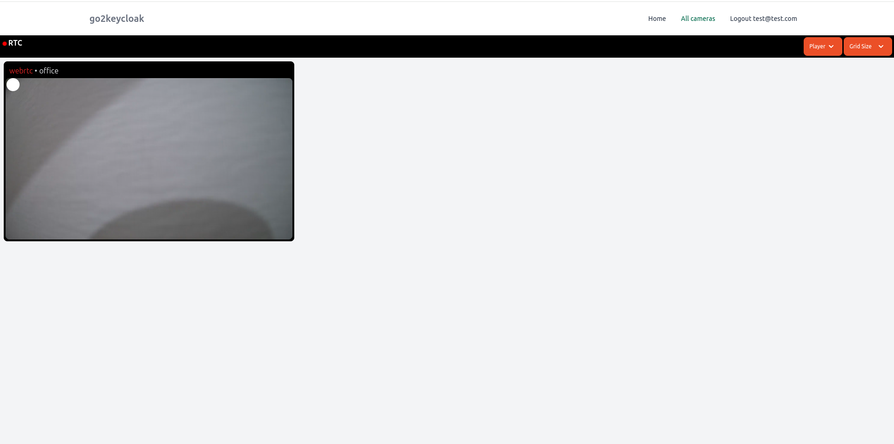

 


# go2rtc_keycloak

`go2rtc_keycloak` is a fork of the [go2rtc](https://github.com/AlexxIT/go2rtc) project. The primary goal of this fork is to integrate [Keycloak](https://www.keycloak.org/) for securing access to the `go2rtc` application.

**Note:** This project is currently in development and is **not production-ready**. Please use it in test environments only and exercise caution before deploying in production. Additional testing and security hardening may be necessary for production use.




## Table of Contents
- [Overview](#overview)
- [Features](#features)
- [Installation](#installation)
- [Configuration](#configuration)
- [Usage](#usage)
- [Contributing](#contributing)
- [License](#license)

## Overview

`go2rtc_keycloak` aims to enhance the security of the `go2rtc` streaming server by adding authentication and authorization capabilities through Keycloak. This integration allows you to protect access to your streams and resources by requiring users to authenticate via Keycloak.

## Features

- **Keycloak Integration**: Protects `go2rtc` streams with Keycloak, allowing secure access management.
- **Role-Based Access Control**: Define specific roles in Keycloak for accessing streams and resources.
- **JWT Validation**: Verifies JSON Web Tokens (JWT) issued by Keycloak for secure access.
  
## Installation

1. Clone the repository:

   ```bash
   git clone https://github.com/yourusername/go2rtc_keycloak.git
   cd go2rtc_keycloak
2. docker-compose:
    ```bash
        docker compose pull
        docker compose up -d
    
3. Keycloak Setup:
   - Log in to your Keycloak server.
- Create a new **client** in Keycloak specifically for `go2rtc_keycloak`.
  - **Client ID**: Choose a unique name, such as `go2rtc_keycloak`.
  - **Client Protocol**: Select `openid-connect`.
  - **Access Type**: Set to `confidential` to require client authentication.
- Configure the **redirect URIs** to include the URL where `front dir app` will be hosted, sveltekit app http://127.0.0.1:5173/*.
- Assign **roles** as needed for controlling access to specific streams and resources.
- Save the client settings
- go to internal/keycloak/keycloak.go and edit the url for keycloak
  
  ```bash
    var (
	    jwksURL = "http://localhost:8080/realms/{your-realm}/protocol/openid-connect/certs"
    )
4. Sveltekit:
   - go to front dir
   ```bash
       pnpm i
       pnpm run dev

5. run go2rtc:

   ```bash
       cd go2rtc_keycloak
       go run .
